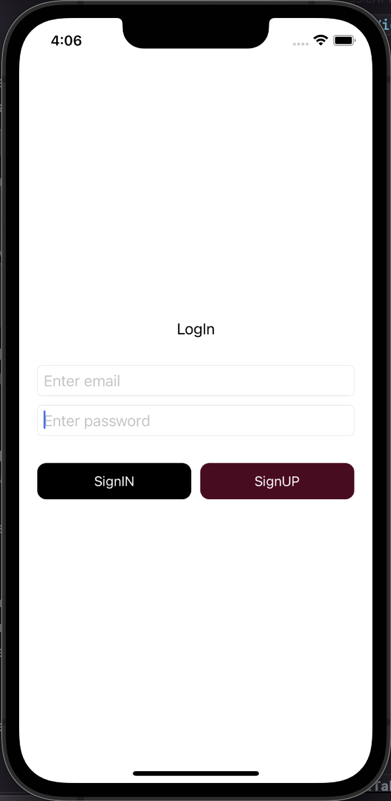
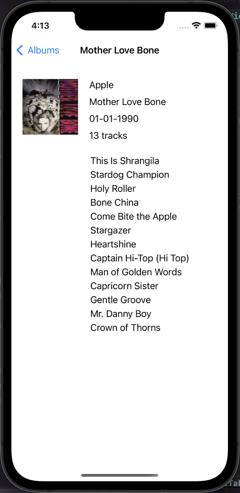

# MusicAPP
___
## Оглавление
- **[Описание](#Description)**
- **[Презентация](#Presentation)**

## Описание
Учебное приложение для поиска музыкальных альбомов с помощью  iTunes Search API. 
Основной функционал: 
1. Регистрация пользователя, с валидацией полей
2. Авторизация пользователя по e-mail  и паролю, проверка на наличие пользователя в «базе»
3. Поиск музыкальных альбомов, сортировка по алфавиту
4. Отображение подробной информации по альбому
5. Отображение данных пользователя

- Проект написан на **UIKit**
- Архитектура **MVC**
- Верстка интерфейса **Кодом**
___

## Презентация
### Экран авторизации

### Экран регистрации

### Экран поиска альбомов

### Album info

### User info

### Работа приложения

___

